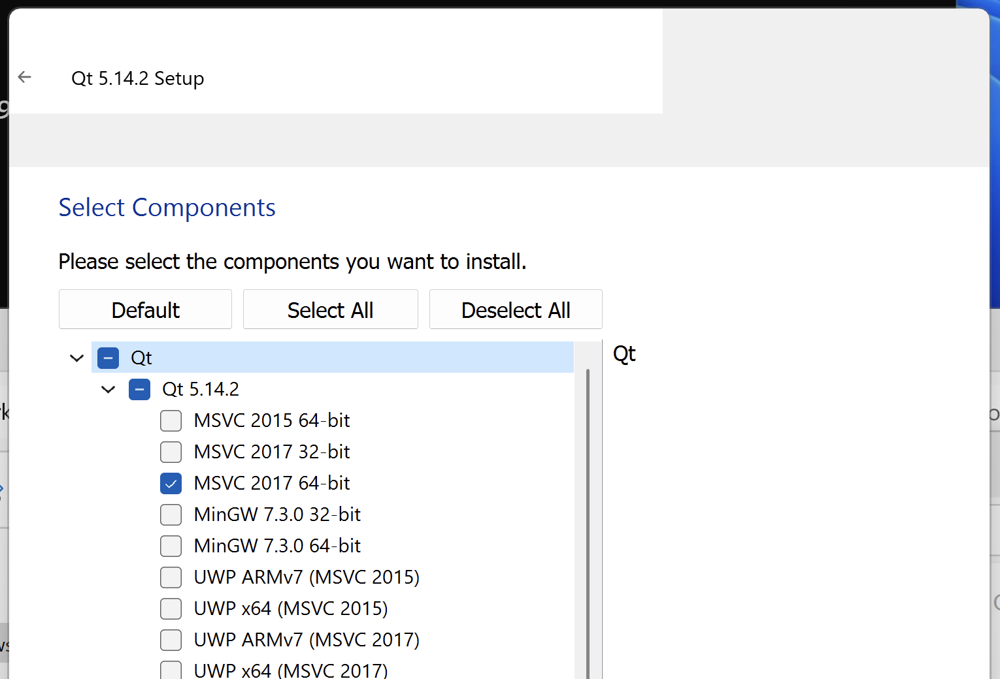
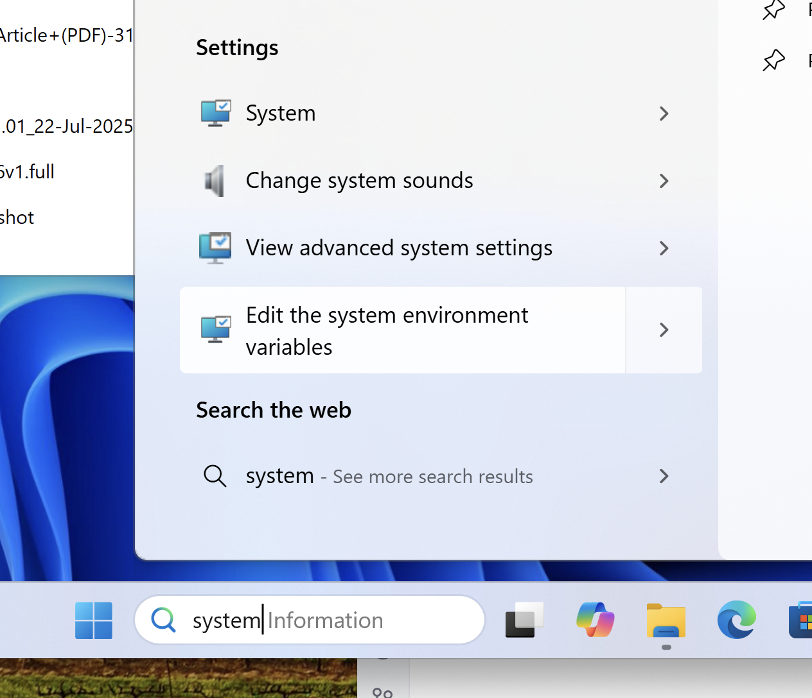
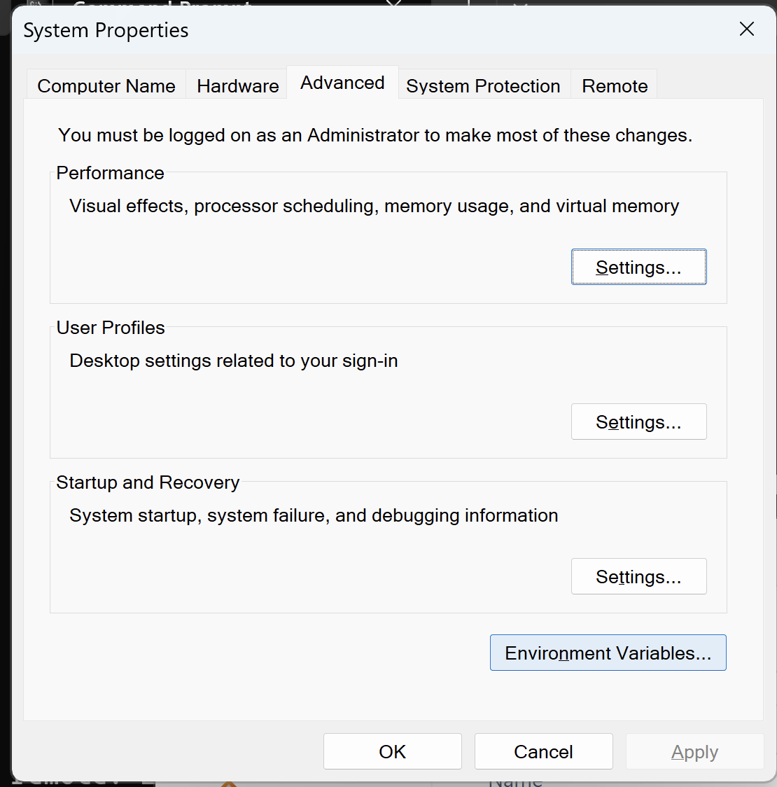
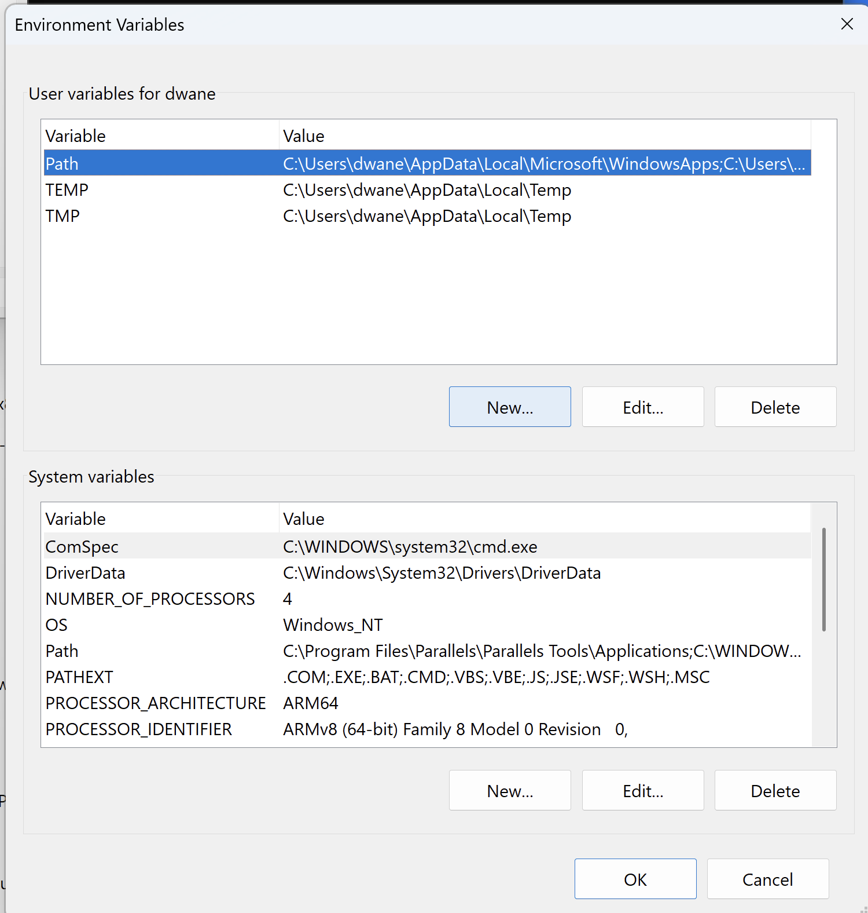
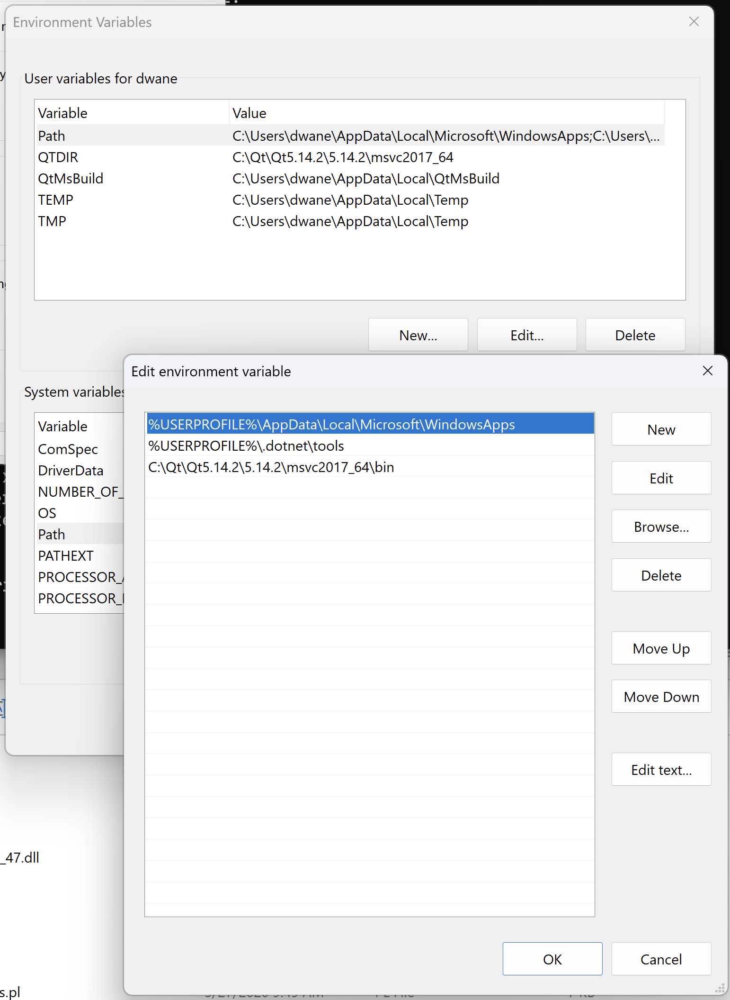
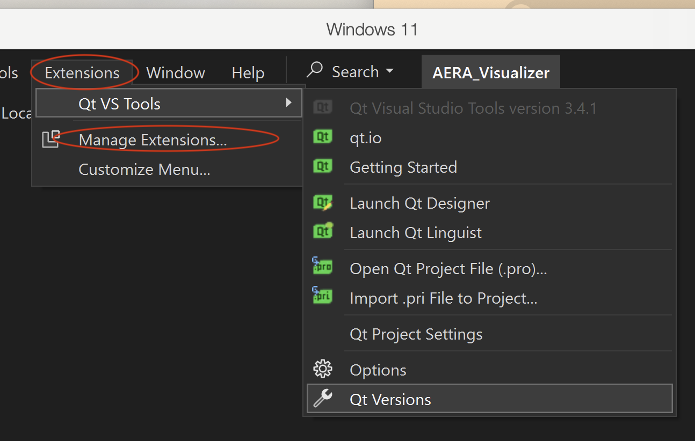
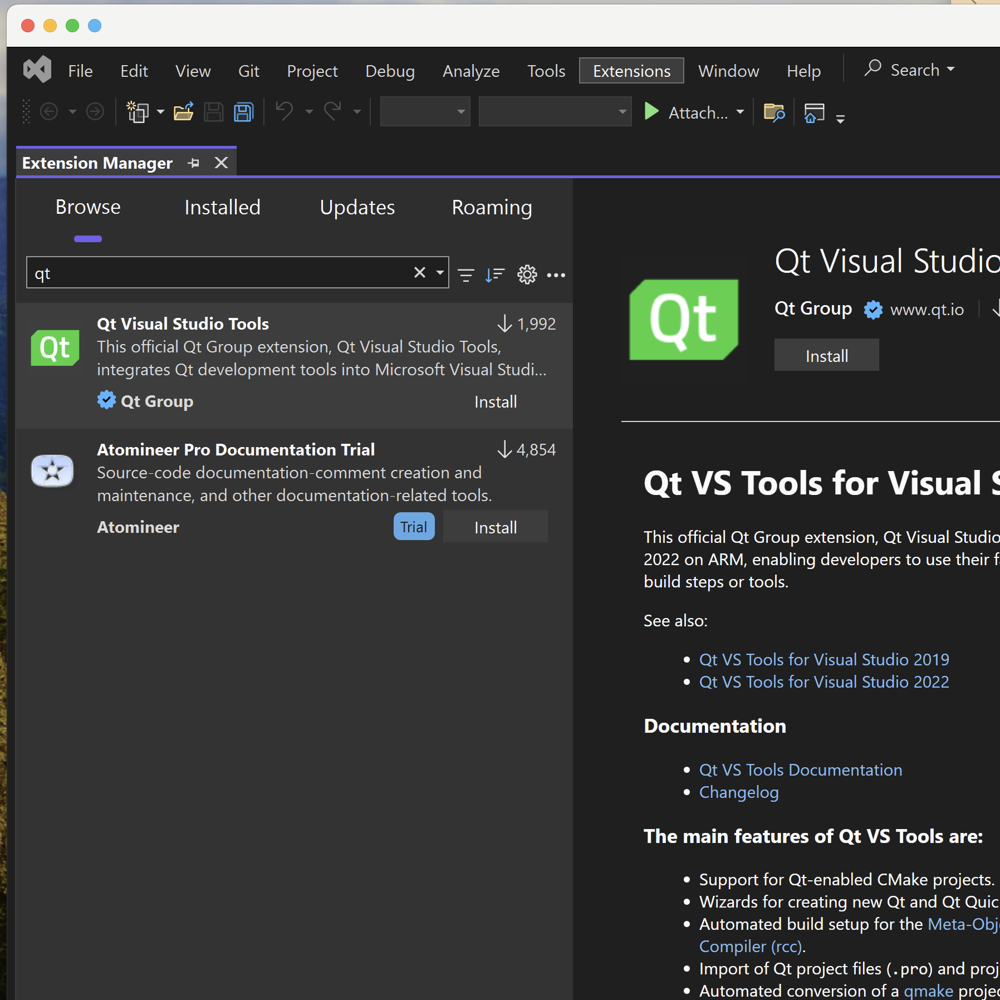

# Guide to getting AERA running on Windows 11 

Last updated August 2025

# 1) Download and install Visual Studio

Visual Studio is an integrated code development environment for writing C++ code (amongst others)

 - 1.1 Start Microsoft Edge (a web browser)
 - 1.2 Browse to https://visualstudio.microsoft.com/vs/community/ and install Visual Studio Community (takes approximately 30 minutes)
   - When asked for workloads, select yes to "Desktop development with C++"
   - Skip connecting to accounts. 

# 2) Install Git 

Git is a source control program that allows getting code from github, and pushing changes back to github if so desired.

 - 2.1 Start Windows Edge (a web browser) open
 - 2.2 browse to https://git-scm.com/download/win 
 - 2.3 Click on "Git for Windows/ARM64 Setup" to download the program, then once downloaded, double click on it.
 - 2.4 Accept the default options when it is installing.

# 3) Create a directory for you projects

 - 3.1 Open a windows command prompt (in the search bar, search for cmd, "command prompt" appears, click it to start that program (<1 min)
 - 3.2 create and move into a directory for you code e.g.
   - mkdir projects
   - cd projects
 - 3.3 Clone the AERA code. This make a copy of the code in your current working directory.
   - git clone --recursive https://github.com/IIIM-IS/AERA.git
 - 3.4 Clone the AERA_visualiser code. This make a copy of the code in your current working directory.
   - git clone --recursive https://github.com/IIIM-IS/AERA_Visualizer.git


# 4) Open AERA in visual studio and build the project

 - 4.1 Open the project (the ./AERA/AERA.sln file) in Visual Studio
 - 4.2 It should look something like:
 


 - 4.3 TODO These popped up in my installation, I do not know if they are important, if they are just because default versions have changed since last set of instructions were written.
	Configuration 'DebugVisualizer|Win32': changing Platform Toolset to 'v143' (was 'v141').
	Configuration 'Debug|Win32': changing Platform Toolset to 'v143' (was 'v141').
	Configuration 'Release|Win32': changing Platform Toolset to 'v143' (was 'v141').

 - 4.4 As per the screenshots and instructions:
 - 
  "In the Solution Configurations drop-down, make sure you select Release (unless you plan to debug AERA).  
  In the Solution Options drop-down, make sure you select Win32.  
  On the Build menu, click Build Solution. (Don't worry about all the compiler warnings.)". 
- 

 - This will have built AERA.exe and other files in the ./Release directory.
 - 4.5 AERA.exe is an executable that can be copied to other machines, and run on them. (Note, the other .lib, .dll, .exp etc files may need to be copied as well) 

# 5) Running AERA

 - 5.1 Copy setting.xml to the Release directory
 - 5.2 Check the settings.xml file has the correct paths in it, i.e. relative paths from the location of AERA.exe, something like:  
    usr_class_path="../../AERA/AERA/replicode_v1.2/user.classes.replicode" 
 -5.3 Set the experiment that you would like run. i.e. in settings.xml set:  
	source_file_name="../../AERA/AERA/replicode_v1.2/hand-grab-sphere.replicode"
 - 5.4 At the command prompt run AERA
```commandline
...\AERA\Release>AERA

```
 - 5.5 This should produce a set of commands created in solving the environment by AERA. Something like:
```commandline
78 root:(mdl [v0: v1: (ti v2: v3:)] []
   (fact (cmd move [v0: v4:] :) v5: v6: : :)
   (fact (mk.val v0: root v7: :) v8: v9: : :)
[]
   v7:(add v1 v4)
   v8:(add v2 100ms)
   v9:(add v3 100ms)
[]
   (neq v7 v1)
   v4:(sub v7 v1)
   v5:(sub v8 80ms)
   v6:(sub v9 100ms)
   v2:(sub v8 100ms)
   v3:(sub v9 100ms)
[root] 1 4 1 1 1 ) []
   [0 0s:0ms:0us 0 forever root nil 0]
   [0 0s:0ms:0us 0 forever root nil 1]

82 primary:(mdl [v0: v1: (ti v2: v3:)] []
   (fact (cmd grab [v0:] :) v4: v5: : :)
   (fact (mk.val v0: root [v1:] :) v6: v7: : :)
[]
   v6:(add v2 100ms)
   v7:(add v3 100ms)
[]
   v4:(sub v6 80ms)
   v5:(sub v7 100ms)
   v2:(sub v6 100ms)
   v3:(sub v7 100ms)
[root] 1 3 0.666667 0.5 1 ) []
   [0 0s:0ms:0us 0 forever root nil 0]
   [0 0s:0ms:0us 0 forever root nil 0.583333]

85 secondary:(mdl [v0: v1: v2: v3:] []
   (fact (cmd release [v0:] :) v4: v5: : :)
   (fact (mk.val v0: root [] :) v6: v7: : :)
[]
   v6:(add v2 100ms)
   v7:(add v3 100ms)
[]
   v4:(sub v6 80ms)
   v5:(sub v7 100ms)
......

```


# 6) AERA Visualiser Prerequisite: Installing Qt Framework 

AERA Visualiser has more prerequisites. This involves installing 3rd party libraries (QT), setting Windows environment variables (so these libraries can be found by other programs), and configuring these libraries in VS.

To install Qt Framework: (see https://github.com/IIIM-IS/AERA_Visualizer/blob/master/INSTALL.md) (1.6GB)
(According to QT: The Qt Framework is a powerful, cross-platform development toolkit primarily used for creating graphical user interfaces (GUIs) and other applications. It is written in C++ and provides a comprehensive set of libraries and APIs to simplify application development. Qt is widely used for desktop, mobile, and embedded systems, offering high performance, modularity, and reusability.)

 - 6.1 Install Qt Framework 
 - 6.2 In a web browser, browse to https://download.qt.io/archive/qt/5.14/5.14.2
 - 6.3 download qt-opensource-windows-x86-5.14.2.exe
 - 6.4 run qt-opensource-windows-x86-5.14.2.exe
 - 6.5 you will need to create a QT account, with an email and password. QT will validate the email.
 - 6.6. during the installation, in the installer on the "Select Components" tab, expand "Qt 5.14.2" and select "MSVC 2017 64-bit". (see image)
 
 - 6.7 When the installer is finished, you can uncheck "Launch Qt Creator" since we don't need to run it, we use it as a library.


# 7) AERA Visualiser Prerequisite: Adding QT into the Visual Studio Tools

 - 7.1 With Visual Studio closed, download and install the Qt Visual Studio Tools from https://marketplace.visualstudio.com/items?itemName=TheQtCompany.QtVisualStudioTools2022 

# 8) AERA Visualiser Prerequisite: Set the QTDIR environment variable

 - Set the QTDIR environment variable do the following:
   - 8.1 with Visual Studio closed:
   - 8.2 Open the System control panel.
   
   - 8.3 Click Advanced System Settings. 
   - 8.4 Click Environment Variables. 
   
   - 8.5 In the "System variables" section, click New... 
   - 8.6 In Variable name enter QTDIR . 
  
   - 8.7 In Variable value enter the directory such as C:\Qt\Qt5.14.2\5.14.2\msvc2017_64        (was  C:\Qt\5.14.2\msvc2017_64 in old documentation)
   
   - 8.8 Repeatedly click OK to close all the windows.

9) Add the location of the exeutible Qt files to the path
 - 9.1 For me this was C:\Qt\Qt5.14.2\5.14.2\msvc2017_64\bin
 

# 10) AERA Visualiser Prerequisite: Configure Visual Studio Tools so that QT can be found and used.

 - 10.1 Launch Visual Studio. 
 - 10.2 On the "splash" screen, click "continue without code". 
 - 10.3 On the Extensions menu, select Manage Extensions
   
 - 10.5 in the browse search bar type 'qt'.                         (this brings up the wrong version. does it matter?)

   

 - 10.6 On 'Qt Visual Studio Tools' click 'install'
 - 10.7 close  Visual Studio (to start the installation)
 - 10.8 Click "Qt VS Tools" then "Qt Versions". Click "". Click the folder icon and select the path containing  bin/qmake.exe.  
     e.g.      C:\Qt\Qt5.14.2\5.14.2\msvc2017_64
     
 - 10.9 click OK

   


 - 9.1 In VS open solution "AERA_Visualizer.sln"

Select Release
Select "x64"
Run via "Local Window Debugger"


# 11) Running the GUI inside Visual Studio (VS)

 - 11.1 Open a command window (cmd.exe) and move to the directory the Release directory of AERA_Visualizer
   - for me this was aera\AERA_Visualizer\x64\Release
 - run the tool that builds the Qt parts of the project, something like:
   - aera\AERA_Visualizer\x64\Release>windeployqt AeraVisualizer.exe


